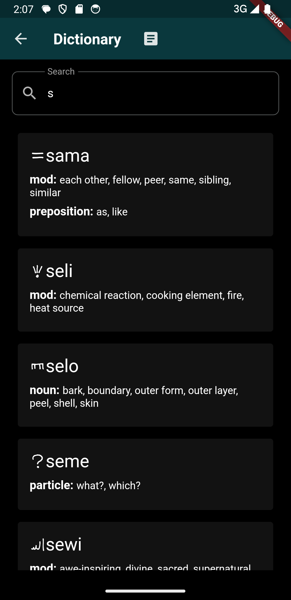
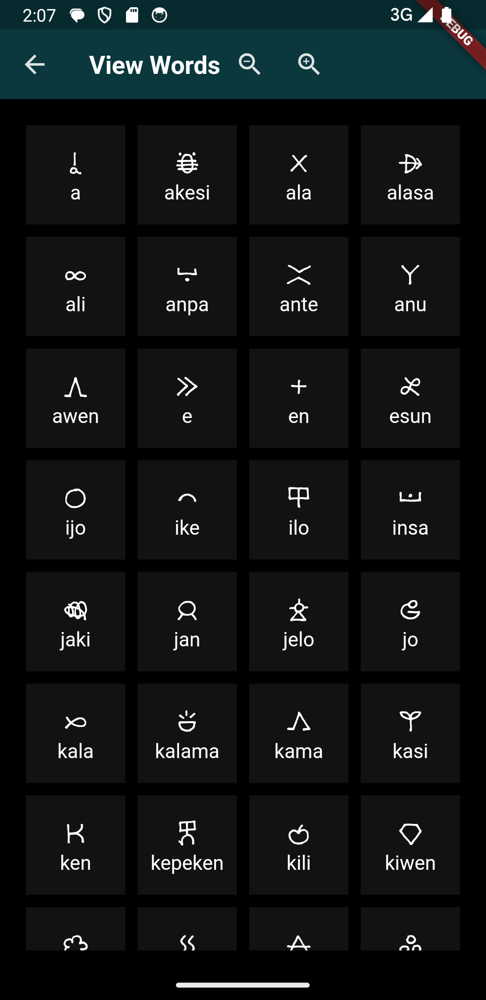
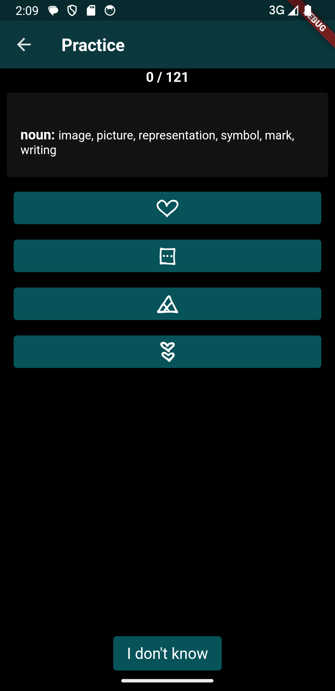
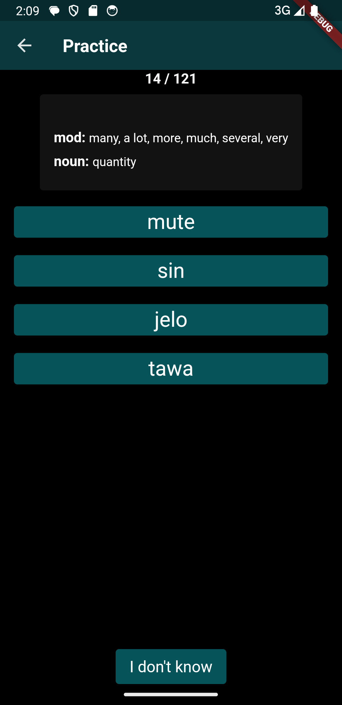
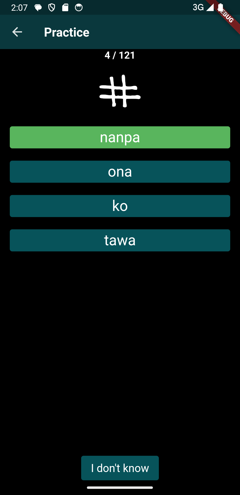
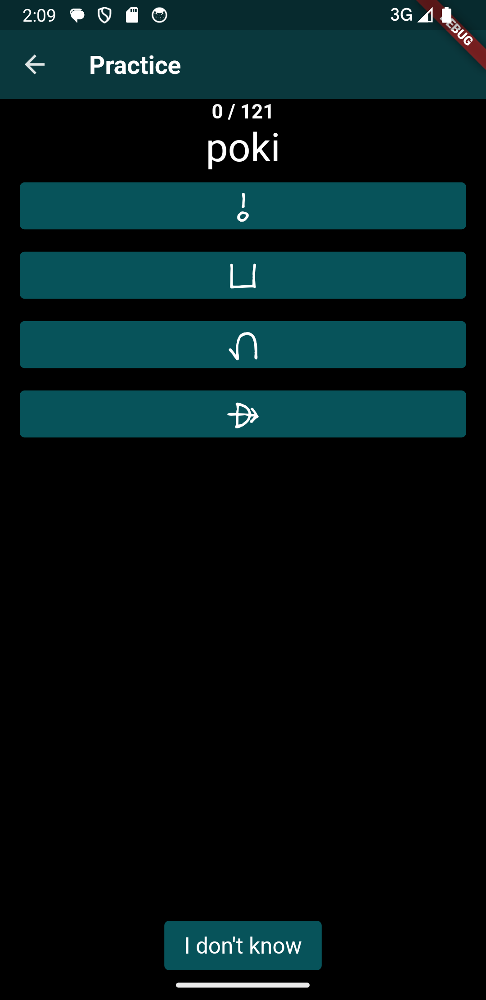
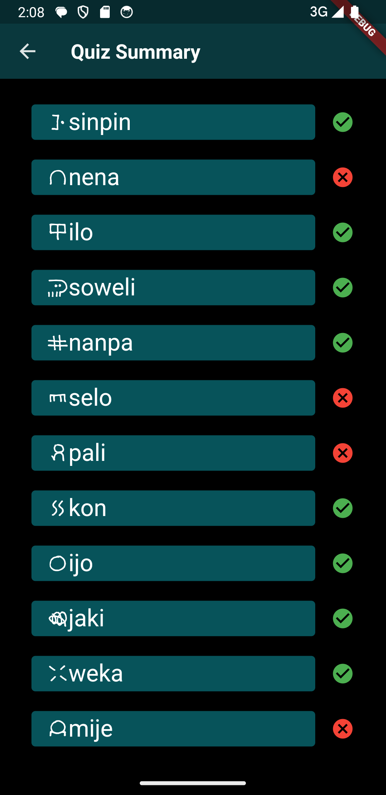
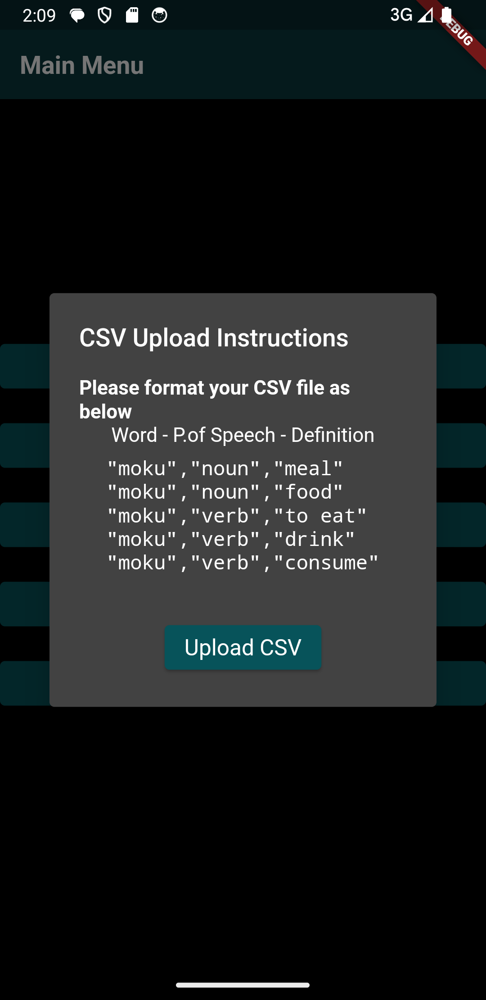

# Toki Pona Custom Dictionary

A Flutter application that helps you learn Toki Pona, and comes with a customisable dictionary!

## Core Features
- Base Dictionary of ~120 words
- Upload your own custom definitions!!!
- Dictionary Search 
- View Toki Pona words (sitelen pona) and definitions
- Quiz yourself on sitelen pona, words, and definitions

## Screenshots

### Dictionary
Search for Toki Pona words and view their definitions



### View Words
Browse through the Toki Pona (sitelen pona) and their words



### Practice
Practice Toki Pona through different types of quizzes!
#### Quiz Options
Choose different quiz types to practice Toki Pona!


#### Definition to Symbol
Match definitions to their corresponding symbols



#### Definition to Word
Match definitions to their corresponding words



#### Symbol to Word
Match symbols to their corresponding words



#### Word to Symbol
Match words to their corresponding symbols



#### Quiz Summary
View your quiz results!



### Upload Custom Dictionary
Upload your own custom dictionary CSV file to add new words.



## Installation
1. Clone repo: 
```bash
   git clone https://github.com/kyle-t01/toki_pona_learn.git .
   cd toki_pona_learner
```
2. Install Flutter SDK then get Flutter packages
```bash
   flutter pub get
```
3. Running the App on Windows
```bash
   flutter run 
```


## Future
- some more internal testing
- release app on Google Play for Android devices
- make project open source
- update word dataset

## Acknowledgements
Font: sitelenselikiwenasuki.ttf, https://github.com/kreativekorp/sitelen-seli-kiwen (jan Lepeka/Rebecca Bettencourt)
Word Dataset: words adapated from Sonja Lang's "Toki Pona: The Language of Good"

## Dataset
CSV file: 
in the form of: word - partofspeech - definition
https://github.com/kyle-t01/toki_pona_learn/blob/main/toki_pona_learner/assets/original_toki_pona_dict.csv

```csv
"moku","noun","meal"
"moku","noun","food"
"moku","verb","to eat"
"moku","verb","drink"
"moku","verb","consume"
```